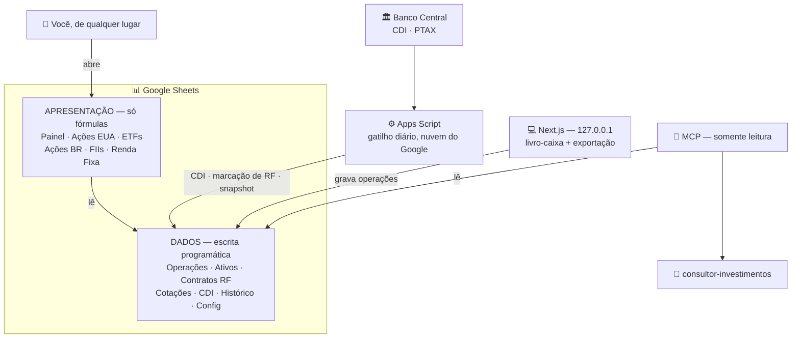

<div align="center">

# 🐙 Octopus

**Gerenciador de investimentos com o Google Sheets como fonte de verdade.**

A planilha é o painel — você abre do celular, de qualquer lugar, e ela se atualiza sozinha.
A interface é só a porta de entrada. O agente de IA lê a carteira de verdade.


</div>

---

## O que é

Três peças, cada uma com um papel bem definido:

| Peça | Papel | Quando roda |
|---|---|---|
| 📊 **A planilha** | O painel. Alocação, posição, preço médio, rentabilidade. | Sempre |
| 💻 **A interface** | A porta de entrada. Cadastra operações com validação. | Quando você abre |
| 🔌 **O servidor MCP** | Dá ao agente `consultor-investimentos` acesso à carteira real. | Sob demanda |

A planilha continua viva mesmo com a interface desligada — que é o estado normal.
Um Apps Script na nuvem do Google busca o CDI no Banco Central, marca a renda fixa
na curva e grava o snapshot mensal do patrimônio.

## Arquitetura



A interface e o MCP compartilham o mesmo módulo de cálculo, então nunca respondem
números diferentes para a mesma pergunta. O MCP não passa pela API HTTP — ele lê a
planilha direto, e por isso responde com o `next dev` desligado.

**Duas regras sustentam o desenho:**

- **Abas de dados ≠ abas de apresentação.** O código só escreve nas abas de dados.
  As visuais são derivadas por fórmula — reformatar, mover gráfico e trocar cor não quebra nada.
- **`Operações` é append-only.** É o livro-razão. Posição e preço médio são *projeções*
  dele, nunca campos guardados: dá auditoria e permite recalcular tudo do zero.

## Custo: R$ 0,00

Nenhuma peça tem cobrança, free trial que expira ou free tier que estoura.

| Peça | Limite | Seu uso |
|---|---|---|
| Google Sheets | 10 mi de células | centenas de linhas/ano |
| `GOOGLEFINANCE` | sem cobrança | ~20 ativos |
| Apps Script | 20.000 `UrlFetch`/dia | 1 execução/dia |
| Sheets API | 300 req/min | dezenas por dia |
| APIs do Banco Central | abertas, sem chave | 1 chamada/dia |
| Hospedagem | **não existe** | roda em `localhost` |

> [!TIP]
> Criar o projeto no Google Cloud e habilitar a Sheets API **não exige cartão de crédito**.
> Se o console pedir faturamento, a API habilitada foi a errada.

Cotações vêm do `GOOGLEFINANCE` embutido na planilha — nenhum provedor de dados pago
entra no projeto.

---

## Setup

Uma vez só, ~10 minutos.

<table>
<tr><td><b>1</b></td><td>

**Google Cloud** — em [console.cloud.google.com](https://console.cloud.google.com):
criar projeto → *APIs & Services* → habilitar **Google Sheets API**

</td></tr>
<tr><td><b>2</b></td><td>

**Service account** — *IAM & Admin* → *Service Accounts* → criar →
*Keys* → *Add key* → *JSON* → baixar

</td></tr>
<tr><td><b>3</b></td><td>

Mover o JSON para `./secrets/service-account.json` *(a pasta é ignorada pelo git)*

</td></tr>
<tr><td><b>4</b></td><td>

Criar uma **planilha vazia** no seu Google Drive

</td></tr>
<tr><td><b>5</b></td><td>

**Compartilhar** a planilha com o `client_email` do JSON, como **Editor**

</td></tr>
<tr><td><b>6</b></td><td>

`cp .env.example .env.local` e preencher o `CARTEIRA_SPREADSHEET_ID`
*(o trecho da URL entre `/d/` e `/edit`)*

</td></tr>
</table>

Daí em diante o instalador monta a planilha inteira:

```bash
npm install
npm run sheet:install     # abas, fórmulas, formatação e gráficos
npm run dev               # http://127.0.0.1:3000
```

O mesmo instalador está em `/setup` na interface, com diagnóstico do que já está
pronto e do que falta.

<details>
<summary><b>⚙️ O motor da planilha (Apps Script) — o único passo manual</b></summary>

<br/>

Um passo manual sobra, e vale saber por quê: um script vinculado à planilha pertence
a **você**, não à service account, então a API do Google não consegue criá-lo — e a
API do Apps Script não cria gatilhos de tempo.

São dois cliques, uma vez:

1. Na planilha: **Extensões → Apps Script**, cole `apps-script/Code.gs` e salve
2. Recarregue a planilha e clique em **Carteira → Ativar atualização diária**

A página `/setup` mostra esse passo a passo com botão de copiar.

> [!IMPORTANT]
> Sem este passo, a renda fixa não é precificada e o gráfico de 12 meses fica vazio.

</details>

<details>
<summary><b>🤖 O agente consultor</b></summary>

<br/>

```bash
./install.sh              # instala agente, skills e MCP em ~/.claude
./install.sh --uninstall  # remove tudo (a planilha não é tocada)
```

Depois disso o agente funciona de qualquer diretório: a configuração de acesso é
copiada para `~/.config/carteira/config.json`, porque o servidor MCP é lançado de
fora deste projeto e não enxerga o `.env.local`. **A chave em si não é copiada** —
o arquivo guarda o caminho dela.

| Tool MCP | O que devolve |
|---|---|
| `portfolio_summary` | Patrimônio total, alocação por classe, real vs. meta |
| `portfolio_positions` | Posição, preço médio, cotação, rendimento |
| `portfolio_asset` | Detalhe de um ativo + histórico + resgate com IR |
| `portfolio_trades` | Extrato filtrado |
| `portfolio_performance` | Aportado, valor atual, retorno simples e XIRR |

Todas são **somente leitura**, de propósito. O agente analisa, você registra — uma
análise errada você percebe lendo, um lançamento errado contamina preço médio e
imposto em silêncio.

</details>

---

## Comandos

| Comando | O que faz |
|---|---|
| `npm run dev` | Interface em `127.0.0.1:3000` |
| `npm run sheet:install` | Constrói/atualiza a estrutura da planilha *(idempotente)* |
| `npm run sheet:style` | Repinta a planilha. Só aparência — não lê nem escreve valor |
| `npm run sheet:migrate` | Sobe a planilha de versão. `--dry-run` só mostra o plano |
| `npm run sheet:reset` | ⚠️ **Apaga tudo.** Confirmação digitando o nome da planilha |
| `npm run verify:sheet` | Compara o cálculo em TS com as fórmulas da planilha |
| `npm test` | Testes do domínio *(puros, sem rede)* |
| `npm run typecheck` | `tsc --noEmit` |

<details>
<summary><b>🎨 <code>sheet:style</code> — repintar sem reinstalar</b></summary>

<br/>

Cor de aba por classe, cabeçalhos coloridos, listras alternadas, grade escondida e
ganho/perda em verde e vermelho. Alinhamento por **natureza do dado**: número à
direita para as casas decimais alinharem na vertical, data ao centro, texto à esquerda.

É **substitutivo** — listras e regras condicionais antigas são removidas antes das
novas, então rodar dez vezes dá o mesmo resultado de rodar uma. Como não toca em
valor de célula, é seguro rodar com a carteira cheia, e é o jeito de voltar ao padrão
se você mexeu no visual à mão.

O `sheet:install` já chama a estilização no fim.

</details>

<details>
<summary><b>💣 <code>sheet:reset</code> — apagar tudo</b></summary>

<br/>

Apaga **todas** as abas e devolve a planilha ao estado de recém-criada. Destrutivo e
irreversível — o Sheets tem histórico de versões, mas contar com isso não é plano.

Antes de agir, mostra o que será perdido (quantas operações, ativos e contratos) e
exige que você **digite o nome da planilha**, no estilo do GitHub para apagar
repositório. Digitar "s" é reflexo; digitar o nome obriga a ler a tela.

> [!CAUTION]
> Não existe `--force`, de propósito: uma porta dos fundos aqui anularia o único
> mecanismo que protege anos de histórico de aportes.

O Apps Script colado na planilha sobrevive ao reset — ele vive fora das abas.

</details>

---

## Exportar

Botão **Exportar** na interface, ou direto na API:

```http
GET /api/export                       # JSON completo
GET /api/export?format=csv&sheet=X    # uma aba em CSV
GET /api/export?format=list           # nomes das abas
```

<details>
<summary><b>Como ele é robusto</b></summary>

<br/>

**Fidelidade acima de conveniência.** O dump usa o cabeçalho **real** de cada aba e a
largura **real** da grade, lidos da planilha — não a expectativa do `schema.ts`.
Nenhum índice de coluna fixo, nenhuma busca por nome conhecido.

- Coluna que você acrescentou à mão **aparece**
- Coluna que o schema espera e a planilha não tem **não é inventada**
- Cabeçalho vazio vira `Coluna C` — a letra real, para você achar na planilha
- Cabeçalho repetido ganha sufixo em vez de sobrescrever o anterior

**Falha parcial não derruba o todo.** Cada aba é lida em isolamento; uma aba ilegível
vira uma entrada com `error` e o resto sai completo. Se o cálculo da carteira falhar,
`portfolio` vem `null` e os dados brutos continuam lá — um backup que só funciona
quando está tudo bem não é backup.

**O checksum é verificável por qualquer um.** É `sha256` da serialização canônica do
bloco `sheets` (chaves em ordem alfabética, sem espaços), e a receita vai gravada em
`integrity.algorithm`. Não é assinatura — quem editar de propósito recalcula. Detecta
acidente: download truncado, edição sem querer.

**Nada de credencial vai no arquivo:** nem caminho de chave, nem e-mail da service
account. Só o que está dentro da planilha.

Fórmulas não são exportadas, só os valores que produziram — elas são reproduzíveis
com `sheet:install`; os dados é que são insubstituíveis. O CSV leva BOM, sem o qual o
Excel abre UTF-8 como Latin-1 e "Observação" vira "Observação".

</details>

## Injeção de fórmula

Texto que começa com `=` é interpretado como fórmula em **dois** lugares diferentes,
e cada um exigiu uma defesa própria.

| Onde | O que aconteceria |
|---|---|
| **Escrita**, no Sheets | `=HYPERLINK("http://x";"clique")` numa observação vira link ativo **dentro do livro-razão**, e a leitura devolve `clique` em vez do que você escreveu |
| **Leitura**, no Excel | O mesmo texto num CSV vira fórmula ativa na máquina de quem abrir |

Nos dois casos a defesa é **neutralizar, não bloquear**. O valor recebe um apóstrofo,
que é marcador de "isto é texto" e não faz parte do conteúdo — a leitura devolve a
string original. Bloquear rejeitaria uma anotação legítima sem ganhar segurança nenhuma.

Os gatilhos são diferentes de propósito, **medidos em cada destino**: o Sheets só
dispara com `=` e `+`; o Excel também com `-` e `@`. Escapar a mais poluiria anotações
como `-- ajuste manual`. Em ambos, **número nunca é afetado** — a defesa só vale para
texto, senão `-1234,56` sairia corrompido.

> [!NOTE]
> A exceção é o **ticker**, onde uma lista de permitidos é a ferramenta certa: o campo
> tem forma conhecida (`AAPL`, `PETR4`, `BRK.B`, `RF-CDB-BANCO-XP-2028`) e vira critério
> de busca nas fórmulas da planilha. Nome, emissor e observação seguem livres.

---

## Versões do schema

A planilha guarda a versão em `Config!schema_version`; o código declara a que espera em
`SCHEMA_VERSION`. Quando divergem, há dois caminhos — e **nenhum deles é resetar**.

### Mudança aditiva

Coluna nova numa aba de apresentação, aba nova, chave nova em `Config`. O instalador
absorve sozinho: ele reescreve as abas de apresentação inteiras e nunca encosta em
linha de dados.

```bash
npm run sheet:install
```

### Mudança que transforma dados

Coluna inserida no meio de `Operações`, aba renomeada, valor que muda de formato. Aí o
`sheet:install` **se recusa a rodar**, porque escrever o cabeçalho novo por cima das
linhas antigas as desalinharia em silêncio.

```bash
npm run sheet:migrate --dry-run   # o que viria pela frente
npm run sheet:migrate             # aplica, com backup e confirmação
npm run sheet:install             # reconstrói as abas de apresentação
npm run verify:sheet              # confere que planilha e código batem
```

Antes de transformar qualquer coisa, as sete abas de dados são **duplicadas e ocultadas**
dentro da própria planilha (`_bkp_v2_Operações` e companhia). Se algo sair errado, a
recuperação é apagar a aba quebrada e renomear a cópia de volta.

### Três defesas, em camadas

Cada uma cobre um jeito diferente de errar:

| Erro | O que pega |
|---|---|
| Subiu `SCHEMA_VERSION` sem registrar a migração | Um teste falha |
| Migração destrutiva + reinstalar direto | `sheet:install` recusa e manda migrar |
| **Mexeu numa coluna e esqueceu de versionar** | `sheet:install` lê o cabeçalho real e recusa |

A terceira importa mais: é a mais provável e a única que **não depende da disciplina de
quem escreve o código**. Ela distingue o que é seguro do que não é — coluna nova no fim
passa (as linhas antigas só ficam com a célula vazia); renomear, remover, reordenar ou
inserir no meio trava, apontando qual aba e qual coluna divergiu.

<details>
<summary><b>Como funciona uma migração de v2 para v4</b></summary>

<br/>

**Pular versões não existe.** Sair da v2 para a v4 é `v2 → v3 → v4`, uma etapa por vez:

```
apply:3  →  record:3  →  apply:4  →  record:4
```

A versão gravada sobe depois de **cada** etapa, não no fim. É isso que torna a operação
retomável: se a corrente quebrar no v4, a planilha fica registrada como v3 e rodar de
novo aplica só o que falta — em vez de reaplicar o v3 sobre dados que ele já transformou.

Cada migração só sabe transformar **da versão imediatamente anterior**. Nenhuma precisa
perguntar "de onde este usuário veio?", porque o encadeamento garante que ela receba a
estrutura que espera. Se cada uma tivesse que lidar com todos os pontos de partida, cada
versão nova multiplicaria os caminhos possíveis.

Toda versão tem entrada em `src/sheets/migrations.ts`, **inclusive as aditivas** — sem
isso não daria para dizer, olhando o registro, o que aconteceu entre duas versões.

O módulo já traz as primitivas das mudanças destrutivas típicas — `insertColumn`,
`deleteColumn`, `moveColumn`, `renameSheet`, `transformColumn` — para que a primeira
delas seja escrita em três linhas, e não improvisada com a planilha de alguém no meio.

</details>

---

## Estrutura

```
src/domain/     regras de negócio puras, sem I/O — é o que os testes cobrem
src/sheets/     schema.ts (o contrato), bootstrap, styling, migrations, export
src/lib/        zod, dinheiro, câmbio, datas, configuração
src/app/        interface e rotas de API do Next
apps-script/    Code.gs — CDI, marcação de RF e snapshot mensal
mcp/            servidor MCP (somente leitura) para o agente
.claude/        agente e skills que o install.sh publica em ~/.claude
```

### As duas porcentagens

Respondem perguntas diferentes, e por isso convivem:

- **`% da classe`** — nas abas por tipo e na tabela de ativos do Painel. O peso do ativo
  dentro da própria classe: *"BBAS3 é 20%"* quer dizer 20% das suas ações brasileiras.
- **`% atual`** — na tabela de alocação do Painel. O peso da classe na carteira inteira,
  que é o que se compara com a meta para decidir rebalanceamento.

### Uma duplicação consciente

O preço médio é calculado em **dois lugares**: nas fórmulas das abas de apresentação e em
`src/domain/`. Não é descuido — é o preço de a planilha funcionar no celular sem nada
rodando. `src/domain/` é a autoridade; a fórmula é o espelho.

`npm run verify:sheet` é o guarda dessa duplicação: compara as duas contas ativo a ativo
e falha se divergirem mais de um centavo. Também acusa fórmulas quebradas — o sintoma
clássico de locale trocado, em que o Sheets espera `,` onde escrevemos `;`.

> [!WARNING]
> O mesmo vale para `apps-script/Code.gs`, que reimplementa a marcação na curva de
> `src/domain/fixed-income.ts` porque não dá para importar TypeScript lá dentro.
> **Mexeu num, mexa no outro.**

---

## Aviso

Ferramenta pessoal de registro e acompanhamento. Os números que ela mostra são uma
projeção das operações cadastradas — não um informe oficial da corretora, nem base para
declaração de imposto sem conferência.
